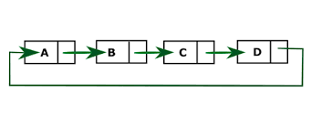

# Circular Linked List

#### The circular linked list is a linked list where all nodes are connected to form a circle. In a circular linked list, the first node and the last node are connected to each other which forms a circle. There is no NULL at the end.




```python
# Circular Linked List

class Node:
    def __init__(self,data):
        self.data = data
        self.next = None

class CircularLinkedList:
    def __init__(self):
        self.head = None
        self.tail = None

# Insertion at Begin
    def Insertion_at_Begin(self,data):
        nb = Node(data)
        # if self.head is None:
        #     self.head = nb
        #     self.tail = nb
        #     self.tail.next = self.head
        # else:
        nb.next = self.head
        self.tail.next = nb
        self.head = nb

# Insertion at End
    def Insertion_at_End(self,data):
        ne = Node(data)
        self.tail.next = ne
        self.tail = ne
        self.tail.next = self.head 

# Insertion at Specific Position
    def Insertion_at_Specific_postion(self,target_data,data):
        np = Node(data)
        temp = self.head 
        while temp.data != target_data:
            temp = temp.next
        np.next  = temp.next
        temp.next = np

# Deletion at begin
    def Deletion_at_Begin(self):
        temp = self.head
        self.head = temp.next         
        temp = None
        self.tail.next  = self.head

# Deletion at End
    def Deletion_at_End(self):
        temp = self.head 
        while temp.next is not self.tail:
            temp = temp.next
        temp.next = self.head
        self.tail = None
        self.tail = temp

# Deletion at Specific Position
    def Deletion_at_Specific_Position(self,data):
        np = Node(data)
        # temp1 = self.head 
        # temp2 = self.head.next
        # while temp1.data != data:
        #     temp1 = temp1.next
        #     temp2 = temp2.next
        # temp1.next = temp2.next 
        # temp2 = None
        temp = self.head
        while temp.next.data != data:
            temp = temp.next
        temp.next = temp.next.next


# Display Linked List

    def Display(self):
        if self.head is None:
            print("Circular Linked List is Empty!")
        else:
            temp = self.head
            print(temp.data,"-->",end = " ")
            while temp.next is not self.head:
                temp = temp.next
                print(temp.data,"-->",end = " ")
            print(temp.next.data)

```

## Function Call


```python
L = CircularLinkedList()

n1 = Node(10)
L.head = n1
L.tail = n1
L.tail.next = L.head

n2 = Node(20)
L.tail.next = n2
L.tail = n2
L.tail.next = L.head 

n3 = Node(30)
L.tail.next = n3
L.tail = n3
L.tail.next = L.head

# Insertion at the Begin
L.Insertion_at_Begin(5)
L.Insertion_at_Begin(1)

# Insertion at the Ending
L.Insertion_at_End(40)
L.Insertion_at_End(50)

# Insertion at the Specific Position
L.Insertion_at_Specific_postion(30,36)
L.Insertion_at_Specific_postion(36,39)

# Deletion at Begin
L.Deletion_at_Begin()

# Deletion at End
L.Deletion_at_End()

# Deletion at the Specific Position
L.Deletion_at_Specific_Position(30)

# Display
L.Display()


```

    5 --> 10 --> 20 --> 36 --> 39 --> 40 --> 5
    
