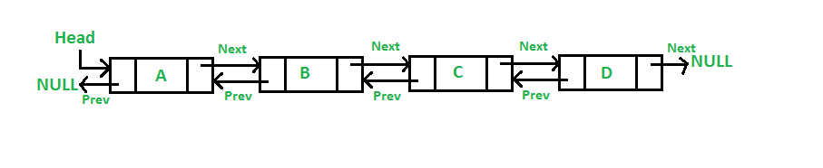

# Doubly Linked List 

### A doubly linked list is a data structure used in computer science and programming. It consists of a sequence of elements, each of which contains a data value and two references or pointers, one pointing to the previous element in the list and another pointing to the next element in the list





```python
class Node:
    def __init__(self,data):
        self.data = data
        self.prev = None # Address of the Previous Node
        self.next = None # Address of the Next Node

class DoublyLinkedList:
    def __init__(self):
        self.head = None

# Insertion at Begining
    def Insertion_at_Begin(self,data):
        n = Node(data)
        temp = self.head
        n.next = temp
        temp.prev = n
        self.head = n
        
# Insertion at Ending
    def Insertion_at_End(self,data):
        n = Node(data)
        temp = self.head
        while temp.next is not None:
            temp = temp.next
        temp.next = n
        n.prev = temp

# Insertion at Specific Position
    def Insertion_at_Specific_Position(self,target_data,data):
        np = Node(data)
        temp = self.head
        while temp.data != target_data:
            temp = temp.next
        np.prev = temp
        np.next = temp.next
        np.next.prev = np
        temp.next = np

# Deletion at Begining

    def Deletion_at_Begin(self):
        temp = self.head
        self.head = temp.next
        temp.next = None
        self.head.prev = None

# Deletion at End

    def Deletion_at_End(self):
        temp = self.head.next
        before = self.head
        while temp.next is not None:
            temp = temp.next
            before = before.next
        before.next = None
        temp.prev = None
            
# Deletion at Specific Position

    def Deletion_at_Specific_Position(self,data):
        np = Node(data)
        temp = self.head.next 
        before = self.head
        while temp.data is not data:
            temp = temp.next
            before = before.next
        before.next = temp.next
        temp.next.prev = before
        temp.prev = None
        temp.next = None
        

# Display Linked List
            
    def Display(self):
        if self.head is None:
            print("Doubly Linked List is Empty")
        else:
            temp = self.head
            while temp:
                print(temp.data,"--><--",end = " ")
                temp = temp.next
                
```

## Function Call


```python

L = DoublyLinkedList()

n1 = Node(10)
L.head = n1
n2 = Node(20)
n2.prev = n1
n1.next = n2
n3 = Node(30)
n3.prev = n2
n2.next = n3
n4 = Node(40)
n4.prev = n3
n3.next = n4

# Insertion at the begining
L.Insertion_at_Begin(5)
L.Insertion_at_Begin(1)

# Insertion at the Ending
L.Insertion_at_End(50)
L.Insertion_at_End(70)

# Insertion_at_Specific_Position(50,60)
L.Insertion_at_Specific_Position(50,60)
L.Insertion_at_Specific_Position(60,65)

# Deletion at the Begining
L.Deletion_at_Begin()

# Deletion at the Ending
L.Deletion_at_End()

# Deletion at the Specific Position
L.Deletion_at_Specific_Position(40)
L.Deletion_at_Specific_Position(30)

# Display 
L.Display()

```

    5 --><-- 10 --><-- 20 --><-- 50 --><-- 60 --><-- 65 --><-- 
